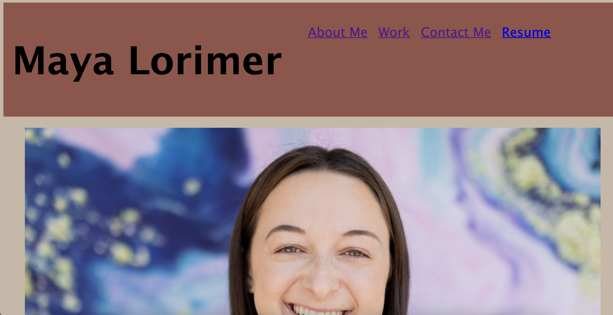

# Portfolio

## Description
This repository contains a portfolio showcasing my background, how to contact me, and projects I have worked on. The repository also contains an assets folder with the images used in my portfolio as well as a CSS folder with my stylesheet. The portfolio links to active Github pages to access my previous projects. 

## Links
- Github Repository: https://github.com/mayalorimer/Portfolio
- Github Page: https://mayalorimer.github.io/Portfolio/

## Technologies Used
 - HTML
 - CSS

## Screenshot

